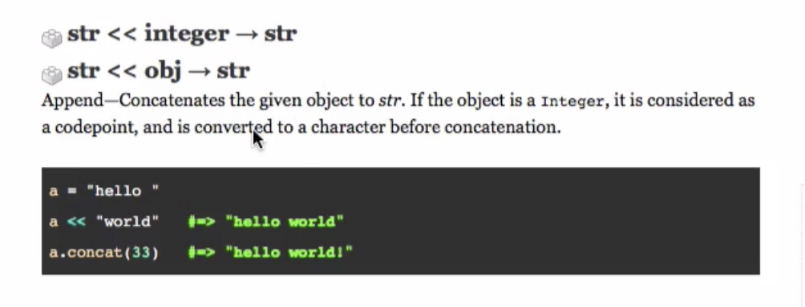

# 
 [Launch School Live Session: Beginning Ruby](https://launchschool.com/blog/live-session-beginning-ruby)

* [Part 1 (syntactical sugar, where code comes from, and variable scope)](https://launchschool.com/blog/live-session-beginning-ruby)
* [Part 2 (pass by reference/value, variables as pointers, method side-effects vs return value)](https://launchschool.com/blog/live-session-beginning-ruby-part-2)
* [Part 3 (Arrays and Hashes, common mistakes when using select and map, and the Enumerable module)](https://launchschool.com/blog/live-session-beginning-ruby-part-3)
* [Part 4 (a student works through some exercises)](https://launchschool.com/blog/live-session-beginning-ruby-part-4)
* [Part 5 (a student works through some exercises)](https://launchschool.com/blog/live-session-beginning-ruby-part-5)
* Part 6 (how to debug for beginners)

## 
 Part 1

  1. Syntactical Sugar
      - is it a method or variable?
        - Optional parenthesis for invoking a method. Adding parenthesis explicitly shows it's  a method.
      - __Be hyperaware of syntactical sugar cases__

  2. Where The Code Comes from
      - coding with intention
      - two parts
        - Standard library require 'name'
        - core library
      -Gem require 'name'
      - Our Own Files
      - Frameworks like rails
  3. Variable Scope (local variable scope)
      - no keyword difference between variable initiation and variable reassignment.

  __Take home message BUILDING A MENTAL MODEL OF RUBY IS CRITICAL TO UNDERSTANDING THE LANGUAGE AND SAME GOES FOR WHEN YOU LEARN ANOTHER LANGUAGE__

  ## 
 Part 2

  i. Pass by reference vs pass by value

  ii. [Variables as pointers.](https://launchschool.com/books/ruby/read/more_stuff#variables_as_pointers)
    - Assignment (initialization)

    - Reassignment

    - Destructive method or mutating the object

    

      - When the arrow in the documentation points to the same variable it is destructive. When it points to a different variable it creates a new object.

    - [Mutating the Caller](https://launchschool.com/books/ruby/read/methods#mutatingthecaller)

      - A method assigns the given argument to the methods parameter variable.

      - At this point the method can

        - mutate the caller the original object assigned

        - or it can reassign the the parameters variable to a new value.

  iii. Method return value vs side effects

    - Destructive or a creator

      - if we write a destructive method make sure to use the ! at the end of the method.

## 
 Part 3

1. Arrays and Hashes

  - Must know the side effects and return value of methods that are being called on Hashes and Arrays. Especially loops and iterators.

2.  Common mistakes when using select and map

  - select returns a new array of return values that evaluate to true.
  - if the block returns nil or false the new array will be empty.
3. The Enumerable module

  - It requires that the class include the each method.
  - It is important to be aware of the return values.

  ## 
 Part 4

  Be sure to take baby steps towards solving the exercise. Run the code many times at each step and on each element.

  There is no reason for ambiguity during any point in the process because you can always check the outputs.

## 
 Part 5

## 
 Part 6 

### Personal

* temperament
* code with intention
* fanatical attention to details.
### General Approach

* reproduce the error consistently (have a holistic understanding, with multiple solutions)
* figure out a solution.
* pay attention to code smells.
### Tools
* puts vs print vs p
* paying attention to return val vs output, and terminal vs irb
* pry
* rubber duck
